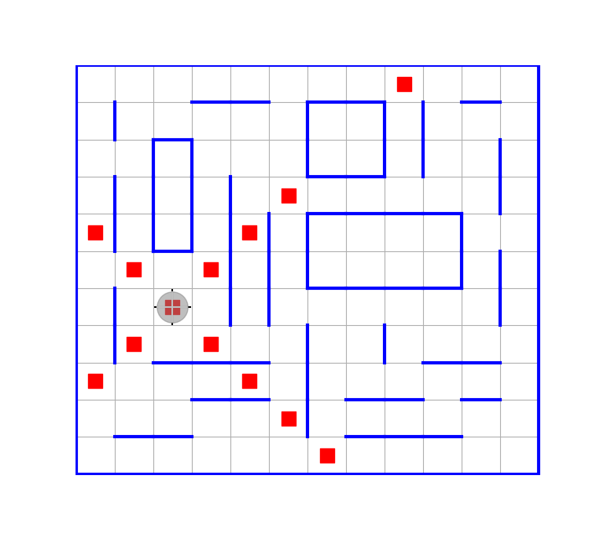

# РОБОТ НА КЛЕТЧАТОМ ПОЛЕ СО СТОРОНАМИ ГОРИЗОНТА

Данное программное обеспечение предназначено для поддержки начального курса программирования для студентов первого курса.

Основная цель курса — научить писать хорошо структурированный программный код, основываясь на технологии проектирования «сверху вниз» и используя идеи обобщённого программирования.

Робот на клетчатом поле позволяет легко формулировать учебные задачи, сложность которых может варьироваться в достаточно широких пределах. При этом сама предметная область остаётся простой и наглядной, что позволяет сосредоточить внимание прежде всего на проектировании программы, декомпозиции задачи и организации программного кода.

Лежащие в основе методические идеи восходят к учебнику А. Г. Кушниренко и Г. В. Лебедева «Программирование для математиков», 1988.

Курс базируется на языке программирования Julia. Этот язык выразителен, относительно прост в изучении, обладает ясным синтаксисом и развитой системой типов, поддерживает различные парадигмы программирования, имеет хорошие интерактивные возможности и сочетает динамический характер языка с компиляцией специализированного машинного кода. Julia хорошо подходит как для математических и технических вычислений, так и для программирования общего назначения.

---

## ОГЛАВЛЕНИЕ

- [Установка и начало работы](setup.md)
- [Пример разработки программного кода](source_mark_kross.md)

---

## Дополнительные материалы

- [Официальная документация языка Julia](https://docs.julialang.org/)
- [Русскоязычная документация Julia в проекте Engee](https://engee.com/helpcenter/stable/ru/julia/engee-language.html)
- [Авторское руководство по программированию в Wiki проекта](https://github.com/Vibof/HorizonSideRobots.jl/wiki)