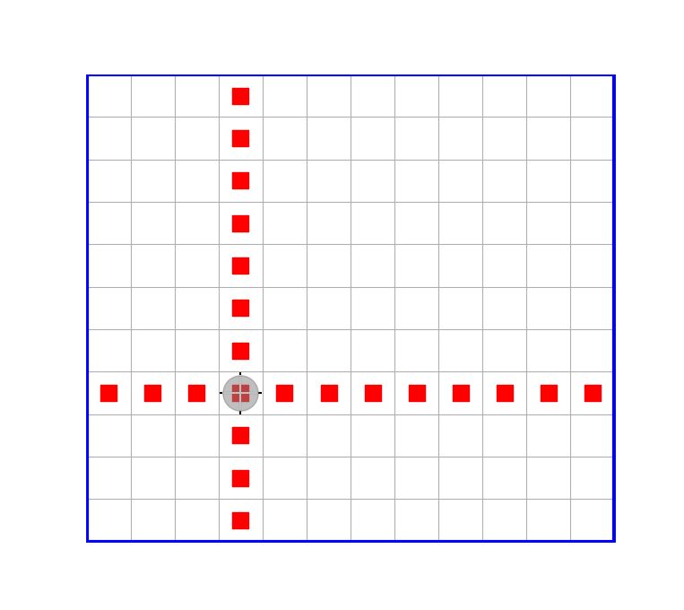

# Пример разработки программного кода

Рассмотрим задачу, которую сформулируем в виде требований к начальному состоянию объекта типа `Robot` и к его конечному состоянию:
```
ДАНО: 
    -- Робот находится в произвольной клетке ограниченного прямоугольного поля без 
    внутренних перегородок и маркеров.

РЕЗУЛЬТАТ: 
    -- Робот — в исходном положении (инвариант) в центре прямого креста из 
    маркеров, расставленных вплоть до внешней рамки.
```
Требуется написать функцию, получающую в виде аргумента этот объект и реализующую указанные требования, называемые контрактом функции.

На следующем рисунке показан пример ожидаемого результата выполнения разрабатываемой функции.



Ниже приведён пример программного решения данной задачи. Сам алгоритм здесь намеренно выбран очень простым: основная цель примера — показать, как должен выглядеть хорошо написанный код и к чему стоит стремиться при выполнении дальнейших учебных заданий.

Для того чтобы акцентировать внимание на важных элементах приведённого решения, далее даются поясняющие замечания. Эти замечания касаются не только и не столько особенностей языка Julia, сколько важных архитектурных решений и общих подходов к проектированию программы.

В частности, даются предварительные пояснения о том, как следует типизировать аргументы функций в связи с обобщённым подходом к программированию, а также о технологии проектирования «сверху вниз».

Не следует воспринимать эти пояснения как исчерпывающие — это всего лишь общая ознакомительная информация предварительного характера. По-настоящему подобные вещи могут быть усвоены только в результате систематического изучения и самостоятельного решения значительного числа специально подобранных задач.


Кроме того, для контраста в конце приведён антипример — пример типичного для начинающих плохого решения той же самой задачи с пояснениями, почему это так.

## Пример программного кода

```julia
"""
    mark_kross!(robot)
    mark_kross!(robot, directs)

ДАНО: 
    -- Робот находится в произвольной клетке ограниченного прямоугольного поля без 
    внутренних перегородок и маркеров.

РЕЗУЛЬТАТ: 
    -- Робот — в исходном положении (инвариант) в центре креста из маркеров, 
    расставленных вплоть до внешней рамки.
"""
function mark_kross!(robot, directs = (Nord, Ost, Sud, West)) # — главная функция  
    for side in directs # — перебор всех возможных направлений
        n = putmarkers!(robot, side)
        move!(robot, inverse(side), n)
    end
    putmarker!(robot)
end


"""
putmarkers!(robot, side) 

ДАНО: 
    -- Робот в некоторой клетке поля

РЕЗУЛЬТАТ: 
    -- Робот переместился до упора в направлении side по прямой;

    -- во всех пройденных клетках кроме начальной поставлен маркер

    -- возвращено число сделанных Роботом шагов
"""
function putmarkers!(robot, side) 
    num_steps = 0
    while isborder(robot, side) == false 
        move!(robot, side)
        putmarker!(robot)
        num_steps += 1
    end
    return num_steps
end


import HorizonSideRobots: move! 

"""
move!(robot, side, num_steps) 

Перемещает Робота в заданном направлении на заданное число шагов
(предполагается, что это возможно — в противном случае произойдёт 
ошибка времени выполнения)
"""
function move!(robot, side, num_steps) 
    for _ in 1:num_steps
        move!(robot, side)
    end 
end


"""

inverse(side::HorizonSide)::HorizonSide

Возвращает направление, противоположное заданному
"""
inverse(side::HorizonSide) = HorizonSide( mod( Int(side) + 2, 4) ) 

```

## Замечания по коду

### 1. Соглашение об именовании функций в языке Julia

В языке Julia действует соглашение, согласно которому имя функции, выполнение которой связано с возможностью изменения состояния объекта, переданного ей в качестве аргумента, заканчивается восклицательным знаком. В данном случае такие функции через соответствующий параметр получают ссылку на объект типа Robot, поэтому состояние этого объекта может быть изменено при выполнении функции.

### 2. Об обобщённых функциях и принципе аннотирования типов аргументов

В приведённых определениях функций, за исключением функции `inverse`, типы их параметров не указаны, хотя в языке Julia такая возможность имеется. Это не случайно, и это связано с тем, что все написанные функции, кроме функции `inverse`, являются обобщёнными. Что это означает, и почему это хорошо — это отдельный большой разговор, сейчас же просто стоит обратить на это внимание. Общий принцип, которого пока стоит придерживаться при проектировании новых функций, таков: если имя типа какого-либо аргумента функции непосредственно не используется в её теле, то в списке параметров тип такого аргумента указывать не стоит. 

Иными словами, не следует указывать тип аргумента функции только потому, что разработчиком в данный момент ожидается аргумент именно этого типа. Тип аргумента функции следует указывать лишь тогда, когда знание этого типа необходимо для её реализации.

В связи со сказанным следует также обратить внимание на то, что второй параметр функции `mark_kross!(robot, directs = (Nord, West, Sud, Ost))` имеет значение по умолчанию — кортеж из четырёх значений типа `HorizonSide`. Разберём этот момент подробнее. Для решения поставленной задачи параметр `directs` можно было бы не вводить вообще, и вместо этого можно было бы в теле функции создать одноименную локальную переменную:
```julia
function mark_kross!(robot)
    directs = (Nord, West, Sud, Ost)
    for side in directs # — перебор всех возможных направлений
        n = putmarkers!(robot, side)
        move!(robot, inverse(side), n)
    end
    putmarker!(robot)
end
```
Однако реализация этой функции в таком случае оказалась бы непосредственно связанной с конкретным представлением направлений — значениями `Nord`, `West`, `Sud`, `Ost` типа `HorizonSide`. Дело в том, что типы `Robot` и `HorizonSide` взаимосвязаны. В самом деле, если мы, следуя принципам обобщённого подхода к программированию, допускаем, что параметр `robot` не обязательно должен иметь тип `Robot`, то тогда естественно предполагать, что и направления не обязательно должны быть типа `HorizonSide`.  Именно поэтому ранее предложенное решение имеет параметр `directs`, тип которого тоже не фиксируется. 

В результате, если впоследствии окажется, что имеется какой-то другой Робот с тем же командным интерфейсом, но направления для которого должны задаваться значениями некоторого другого типа (не `HorizonSide`), то функцию `mark_kross!` с двумя аргументами изменять не потребуется: достаточно будет через второй параметр передать ей соответствующий кортеж направлений нужного типа. Конечно, при этом функция `inverse` должна будет быть дополнена новым методом, специализированным для нового типа аргумента. Встроенный в язык механизм, обеспечивающий такую возможность, называется полиморфизмом (отличительная особенность языка Julia состоит в том, что полиморфизм в ней основывается на множественной диспетчеризации, однако применительно к функции, у которой есть только один аргумент, множественную диспетчеризацию можно не упоминать).

Важно отметить, что отсутствие явной типизации параметров функции нисколько не снижает возможности компилятора оптимизировать код, потому что JIT-компилятор Julia умеет выводить тип аргумента функции из его фактического значения, получаемого функцией при её вызове. При этом компилятор Julia для каждого конкретного набора типов аргументов функции создаёт отдельный специализированный исполняемый код, выполняя при этом его оптимизацию. В этом есть принципиальное отличие языка Julia от языка Python, и это является одной из важнейших причин, позволяющих Julia по производительности скомпилированного кода находиться в одном ряду с такими языками, как C++ или Rust.

### 3. Об автодокументировании функций
В троекратных двойных кавычках непосредственно перед определениями функций содержится текст так называемой автодокументации (docstring). Информация, содержащаяся в автодокументации, должна позволять понять назначение функции и её параметров, а также, при необходимости, — описание контракта функции, например, выражаемое условиями в форме "ДАНО" и "РЕЗУЛЬТАТ".  Если функция имеет такую автодокументацию, то по этой функции можно будет получать подсказки о способах её использования с помощью встроенной системы помощи. Разумеется, для этого определение функции должно быть известно системе. Поэтому её определение должно быть загружено в текущую сессию Julia, например с помощью `include(файл_с_кодом_функции)`.

### 4. О функции `inverse` и типе `HorizonSide`

Определение функции `inverse` — это пример краткого (без конструкции `function-end`) определения функции, которое удобно для совсем коротких определений. Определяющее эту функцию выражение:

```julia
HorizonSide( mod( Int(side) + 2, 4) )
```
нужно понимать следующим образом. 

Здесь `Int` — это имя целого типа (для 64-битной вычислительной системы этот тип совпадает с типом `Int64`, а для 32-битной системы —  с типом `Int32`). 

Переменная `side` имеет тип `HorizonSide`, который импортируется из пакета `HorizonSideRobots` вместе с типом `Robot`. Значения этого типа представляют собой элементы перечисления:

```julia
@enum HorizonSide Nord = 0 West = 1 Sud = 2 Ost = 3
```

где `Nord`, `West`, `Sud`, `Ost` — это символические имена, обозначающие стороны горизонта, а `0, 1, 2, 3` — соответствующие им целочисленные номера (в этом можно убедиться, воспользовавшись встроенной системой помощи Julia). 

Выражение `Int(side)` даёт целочисленный номер стороны горизонта `side`. Таким образом, `mod( Int(side)+2, 4)` — это вычисляемый номер противоположной по отношению к `side` стороны горизонта. Наконец, выражение `HorizonSide(mod(Int(side)+2, 4))` преобразует полученное целое число обратно в соответствующее символическое значение типа `HorizonSide`.

### 5. О стандартном встроенном типе `Nothing`

Для обозначения отсутствия содержательного результата в Julia используется специальное значение `nothing`, являющееся единственным значением типа `Nothing`. В частности, конструкции циклов всегда имеют значение `nothing`. 

### 6. О задании диапазона целых чисел 

Выражение `1:num_steps` означает диапазон значений: `1, 2,..., num_steps`, включающий и последнее значение `num_steps`.

### 7. О назначении символа `_`

Фигурирующий в цикле `for` символ `_` на месте параметра цикла означает, что параметр в теле цикла явно не используется, и поэтому не нуждается в имени.

### 8. О последовательности взаимосвязанных определений функций и проектировании «сверху вниз»

Последовательность определений функций в языке Julia принципиального значения не имеет: определение одной функции может содержать вызовы функций, определения которых расположены в тексте программы ниже. 

Важно отметить, однако, что в приведённом примере последовательность определений функций соответствует той, которая естественным образом возникает при следовании технологии проектирования "сверху вниз". Эта технология предполагает, что исходная задача расчленяется на ряд подзадач (это называется декомпозицией задачи). Для выделенных подзадач формулируются контракты, придумываются подходящие имена, определяются списки формальных параметров и возвращаемый результат. При этом программная реализация этих функций (подпрограмм) откладывается до момента, когда с их помощью удастся записать реализацию основной функции. Только после этого приступают к реализации каждой из выделенных вспомогательных функций, которые проектируются в точности по той же схеме.

### 9. О конструкциях импорта `using` и `import`

В языке Julia существует две основные конструкции для использования сущностей, определённых в других модулях: `using` и `import`. Между ними имеется важное различие, когда требуется не только использовать импортированную функцию, но и дополнить её новыми методами.

Например, с помощью 

```julia
import HorizonSideRobots: move! 
```
из пакета `HorizonSideRobots` импортируется функция `move!`. 

Эта функция имеет следующую сигнатуру, т.е. список параметров с указанием их типов:

```julia
move!(robot::Robot, side::HorizonSide)
```
(в чём можно убедиться, воспользовавшись встроенной системой помощи Julia).

После этого импортирования появилась возможность определить новый метод этой функции с сигнатурой:
```julia
move!(robot, side, num_steps) 
```
что на самом деле означает:

```julia
move!(robot::Any, side::Any, num_steps::Any) 
```
где `Any` — это (абстрактный) тип, стоящий во главе всей иерархии типов языка Julia. Сигнатура  нового метода функции `move!` отличается от сигнатуры приведённого выше метода прежде всего числом аргументов: новый метод имеет три аргумента вместо прежних двух. Кроме того, его аргументы не имеют никаких ограничений допустимых типов.

Отсутствие явного указания типа параметра функции в её определении (или явное указание типа `Any`) означает, что в такую функцию потенциально можно передать аргумент любого конкретного типа. Что при этом получится — это уже зависит от наличия или отсутствия необходимых специализаций базовых функций (которые при необходимости всегда могут быть добавлены). 


## Антипример плохо структурированного кода

Ниже приведён вариант кода, решающего всё ту же задачу про расстановку маркеров в форме прямого креста, который должен служить примером того, как не надо делать. Основным недостатком этого кода является то, что в нём отсутствует декомпозиция — выделение структурных подзадач в отдельные функции. Вместо этого в нём многократно повторяются фактически одни и те же фрагменты кода. На практике такой подход приводит к плохо читаемому, трудно проверяемому и неудобному для дальнейшего изменения и совершенствования программному коду. Это, в свою очередь, повышает вероятность ошибок и существенно усложняет сопровождение программы.


```julia
function mark_kross!(robot)
    # Направление на север
    n = 0
    while isborder(robot, Nord) == false
        move!(robot, Nord)
        putmarker!(robot)
        n += 1
    end
    for _ in 1:n
        move!(robot, Sud)
    end

    # Направление на восток
    n = 0
    while isborder(robot, Ost) == false
        move!(robot, Ost)
        putmarker!(robot)
        n += 1
    end
    for _ in 1:n
        move!(robot, West)
    end

    # Направление на юг
    n = 0
    while isborder(robot, Sud) == false
        move!(robot, Sud)
        putmarker!(robot)
        n += 1
    end
    for _ in 1:n
        move!(robot, Nord)
    end

    # Направление на запад
    n = 0
    while isborder(robot, West) == false
        move!(robot, West)
        putmarker!(robot)
        n += 1
    end
    for _ in 1:n
        move!(robot, Ost)
    end

    putmarker!(robot)
end

```

Важно понимать, что подобный код может быть вполне работоспособным и давать правильный результат. Его недостатки проявляются не в этом, а в способе организации программы. Пока задача очень мала (как сейчас), эти недостатки могут казаться несущественными или даже вообще не восприниматься как недостатки. Однако по мере усложнения программы такой стиль быстро приводит к тому, что в коде становится трудно ориентироваться, одинаковые изменения приходится вносить сразу в нескольких местах, а логически самостоятельные части программы оказываются плохо отделены друг от друга.

Начинающему программисту подобный код нередко кажется даже более понятным, чем структурированное решение: все действия записаны непосредственно и выполняются последовательно, а для понимания программы не требуется обращаться к определениям вспомогательных функций и оперировать дополнительными абстракциями. 

Однако такая простота обманчива. Она сохраняется лишь до тех пор, пока программа остаётся очень маленькой. По мере её роста отсутствие декомпозиции приводит к многочисленным повторениям и мешает видеть общую структуру решения.

Представьте, например, что на поле имеются внутренние перегородки. Тогда алгоритм придётся усложнить: Робот уже не всегда сможет просто двигаться по прямой до внешней рамки, потребуется учитывать препятствия и, возможно, обходить их. В плохо структурированной программе соответствующие изменения придётся вносить во все повторяющиеся фрагменты кода отдельно. Однако в правильно декомпозированной программе будет достаточно лишь локально изменить реализацию той части кода, которая отвечает за перемещение Робота по полю, но уже с учётом наличия внутренних перегородок. При этом общая структура решения останется неизменной.

Важным преимуществом проектирования на основе декомпозиции является также возможность повторного использования уже написанного и отлаженного кода. Если некоторая типовая подзадача оформлена в виде отдельной функции и эта функция уже проверена и надёжно работает, то при решении родственных задач нет необходимости каждый раз реализовывать ту же самую логику заново или копировать соответствующий фрагмент старого кода. Достаточно просто повторно использовать уже готовую функцию. Это уменьшает объём дублирующегося кода, снижает трудозатраты, сокращает число возможных ошибок и позволяет сосредоточиться именно на тех особенностях новой задачи, которые действительно являются новыми.

